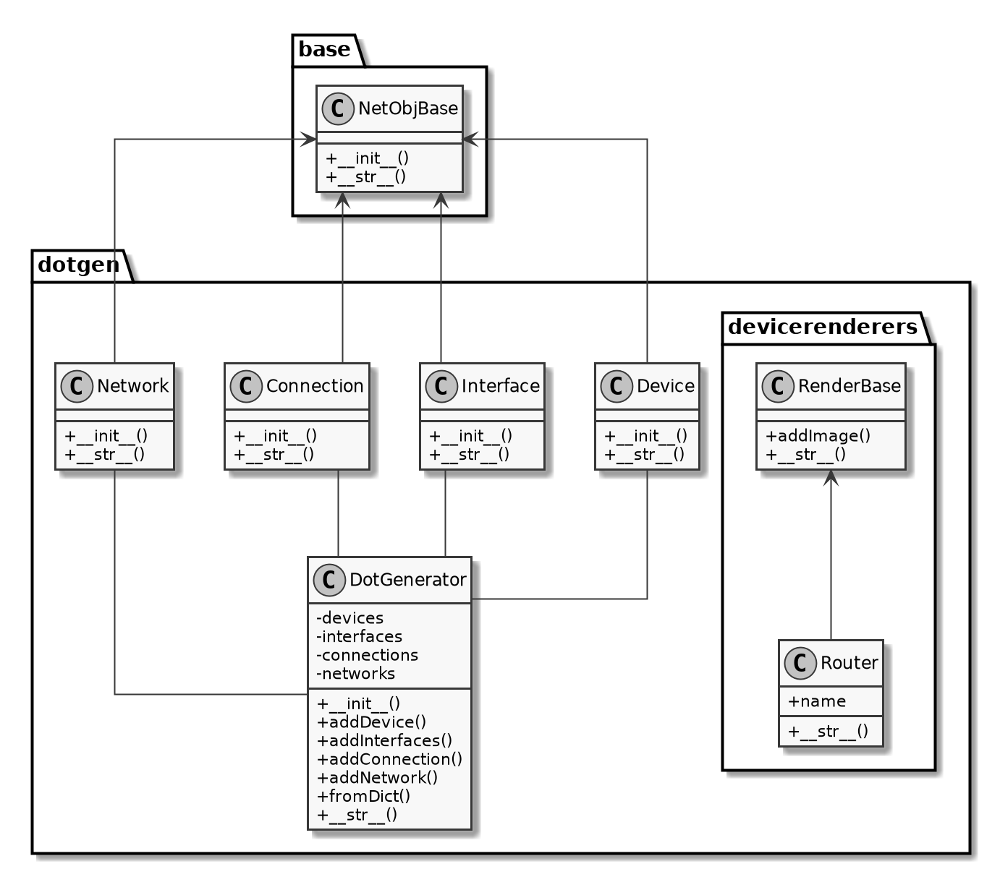

# Root of the network diagram generator.

## Classes **(obsolete)**

## Sorting the nodes.

The nodes are all stored as entries in an unordered dictionary, with their
name as key.

We transform these nodes into a tree using ordered dicttionaries:

        Internet
           |
           |
         Router
           |
           |
         Switch
         |    |
     Server  Client

*Above is an example of the tree for the example [basic_net.yml](../example/basic_net.yaml)*

# Dependencies

 * **ruamel**: pip install ruamel.yaml
 